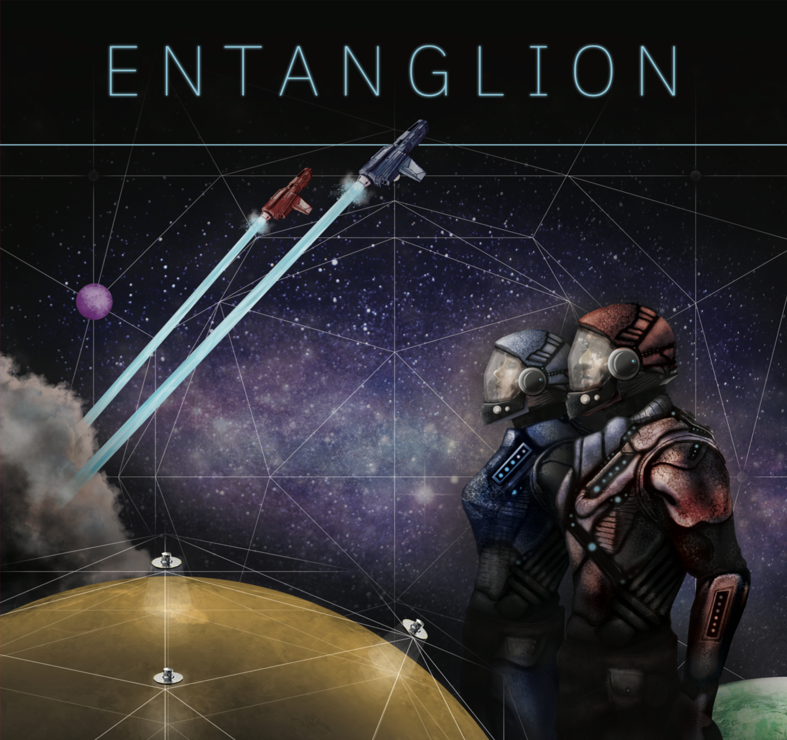
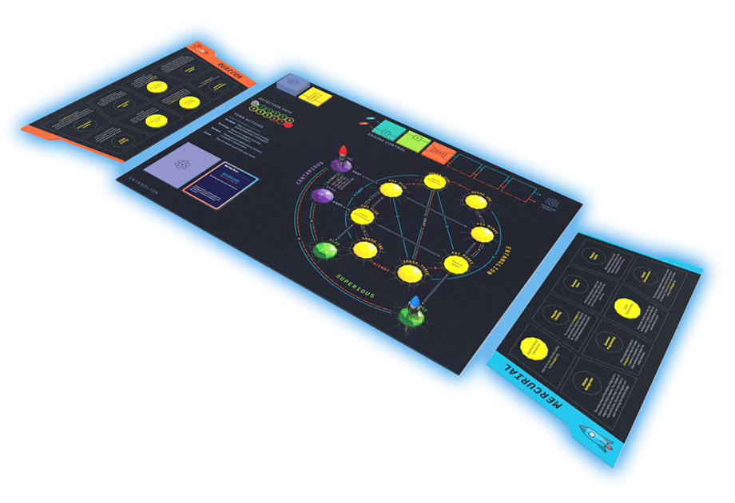

# Entanglion

> Un gioco creato dalla IBM Research : [repository originale](https://github.com/Entanglion/entanglion/tree/main)

> Nota: Questa è la repository relativa alla traduzione italiana effettuata da me: Eleonora Ballarini, tutti i diritti e le immagini originali del gioco appartengono all'IBM Research che io non rappresento in alcun modo ne vi sono collegata!

**2 GIOCATORI | ETÀ 14 & OLTRE | 45 MINUTI**

[Entanglion](http://ibm.biz/entanglion) attende le tue abilità di navigazione spaziale e pianificazione strategica per esplorare una nuova galassia e ricostruire un antico computer quantistico. [Entanglion](http://ibm.biz/entanglion) è un gioco coperativo pensato per due giocatori. Potrai imparare concetti di quantum computing lavorando insieme al tuo compagno di squadra per esplorare tre galassie dell'universo quantistico, evita di essere rivelato dai meccanismi di difesa posizionati dagli antichi, e ricostruisci il computer quantistico.

Pensi di essere pronto alla sfida?

## Benvenuto nell'univeso quantistico, Capitano!
Congratulazioni, il tuo capitano si è ritirato e i ha lasciato al comando della sua ditta di spedizioni galattiche! È il momento di fare qualche miglioria.

Per anni, sei stato ossessionato dalle voci che narrano di un antica tecnologia di computazione quantistica che potrebbe rivoluzionare il mondo del trasporto merci. Se le voci fossero vere, permetterebbero alla tua nave di calcolare percorsi nell’iperspazio in pochi secondi! C’è solo un problema : gli antichi hanno smantellato il loro computer temendo che fosse troppo potente e hanno lasciato i componenti sparsi tra i pianeti, pesantemente sorvegliati, della galassia Entanglion.

Se vorrai ricostruire questa incredibile tecnologia, dovrai far navigare le tue navi attraverso la galassia Entanglion e aggirare le difese posizionate dagli antichi. La buona notizia è che il tuo vecchio capitano ti ha lasciato abbastanza soldi per poter fornire alle tue navi i motori quantistici necessari per entrare in Entanglion. La cattiva notizia è che, senza un computer quantistico che possa guidarli, questi motori possono essere un po'…imprevedibili. 

Vuoi saperne di più? Leggi l'intera storia di Entanglion qui, [Il misterioso destino dei Quantics](gioco/Storia.md).

## Assemblare Entanglion
Entanglion è un progetto open source e puoi creare la tua copia personale del gioco scaricando e stampando i componenti

🚀 **[Guida a Stampa ed Assemblaggio di Entanglion](componenti)**

## Giocare ad Entanglion
Per comprendere come giocare ad Entanglion è necessario leggere il [regolamento](gioco). La versione online del regolamento deve essere considerata quella ufficiale, e qualsiasi errore riscontrato nella guida stampata verrà documentato sull'apposita pagina.

## Insegnare con Entanglion
Se sei un educatore e vuoi usare Entanglion nel programma per i tuoi studenti, per favore [contatta gli sviluppatori originali](mailto:entanglion@us.ibm.com). Saranno lieti di leggere dei tuoi piani per Entanglion e potrebbero anche fornire supporto.

## Espandere Entanglion
Entanglion è un progetto open-source sviluppato dell'IBM Research per insegnare ai giocatori il quantum computing. Sono benvenuti contributi dalla community per modificare e allargare il gameplay.Se vuoi sviluppare tu stesso un'espansione di Entanglion, consulta la sezione [guida all'espansione](expansions).

# Contributori
Entanglion è stato creato dalla IBM Research a New York.

**Design**: [Maryam Ashoori](https://github.com/maryamashoori), [Justin D. Weisz](https://github.com/jweisz) 
**Illustrazioni**: [Aaron Cox](https://twitter.com/aarrccooxx), [Michael L. Kenney](https://www.linkedin.com/in/michaelleekenney/) 
**Scienza**: [Jay M. Gambetta](https://github.com/jaygambetta), [Jerry M. Chow](https://github.com/jerrymchow), and [Lev S. Bishop](https://github.com/levbishop) 
**Traduzione Italiana**: [Eleonora Ballarini](www.linkedin.com/in/eleonora-ballarini-50b4b6166),  

# Licenza
 Questo lavoro è sotto una <a rel="license" href="http://creativecommons.org/licenses/by-nc-sa/4.0/">Creative Commons Attribution-NonCommercial-ShareAlike 4.0 International License</a>.
