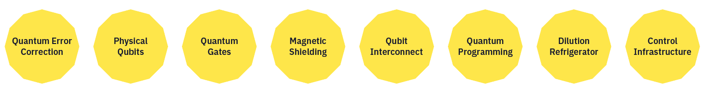
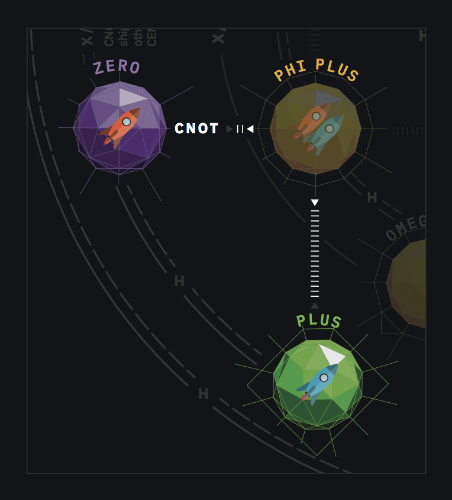
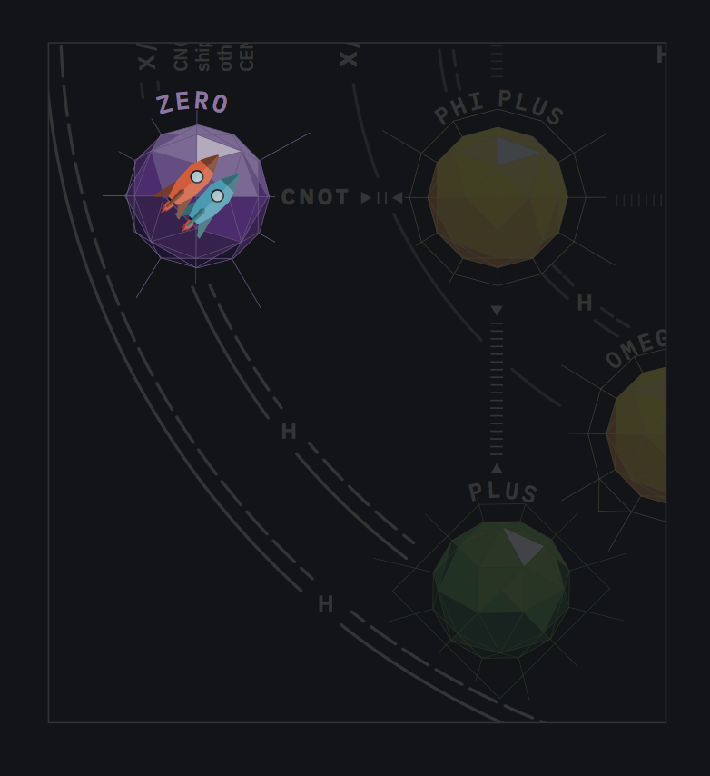
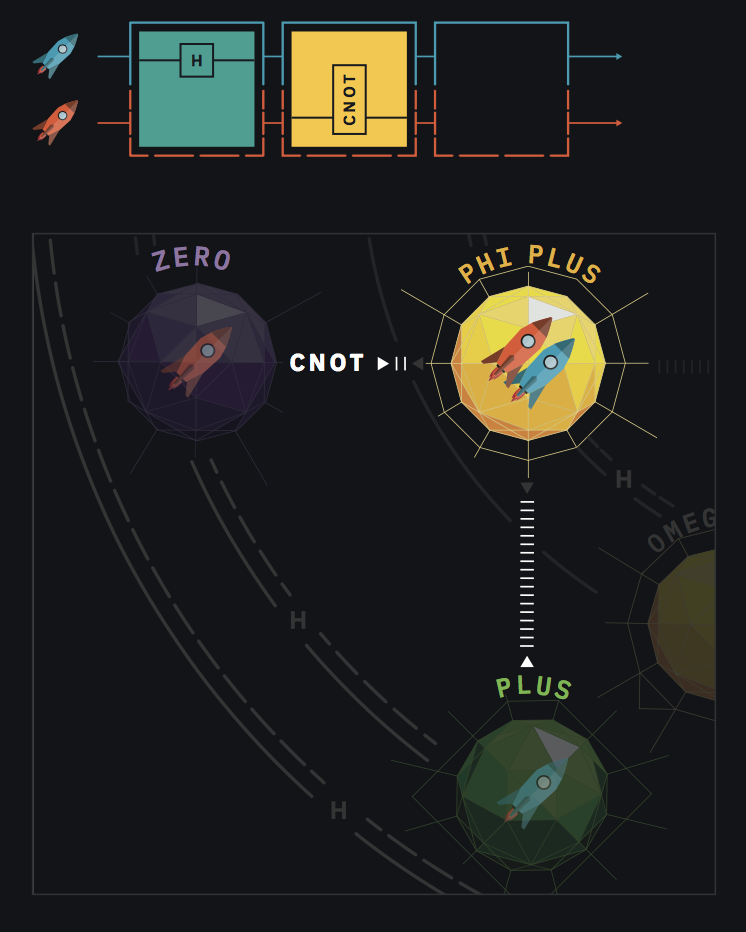
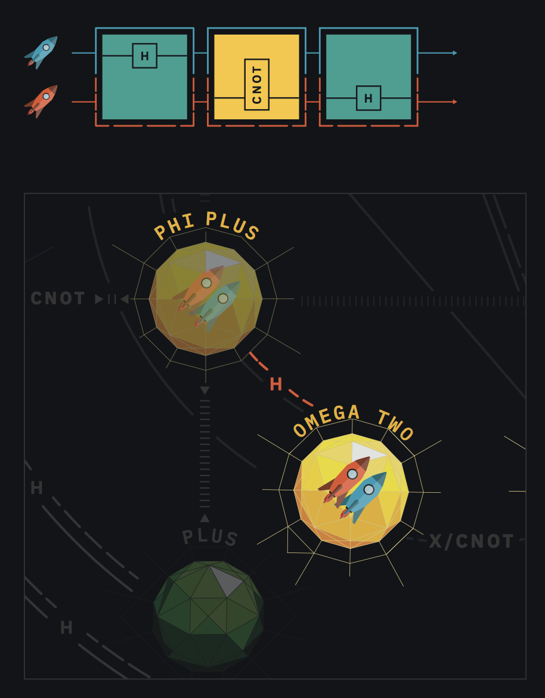

# Regolamento di Entanglion

> Un gioco creato dalla IBM Research

**2 GIOCATORI |  ETÀ 14 & OLTRE | ~45 MINUTI**

Entanglion attende le tue abilità di navigazione spaziale e pianificazione strategica per esplorare una nuova galassia e ricostruire un antico computer quantistico. 

http://ibm.biz/entanglion

> 🤔 Confuso riguardo il regolamento? Dai uno sguardo alla pagina [errata](Errata.md) per chiarificazioni sulle regole ed eventuali aggiunte.

# Benvenuto nell'universo quantistico, Capitano!

Congratulazioni, il tuo capitano si è ritirato e i ha lasciato al comando della sua ditta di spedizioni galattiche! È il momento di fare qualche miglioria.

Per anni, sei stato ossessionato dalle voci che narrano di un antica tecnologia di computazione quantistica che potrebbe rivoluzionare il mondo del trasporto merci. Se le voci fossero vere, permetterebbero alla tua nave di calcolare percorsi nell’iperspazio in pochi secondi! C’è solo un problema : gli antichi hanno smantellato il loro computer temendo che fosse troppo potente e hanno lasciato i componenti sparsi tra i pianeti, pesantemente sorvegliati, della galassia Entanglion!

Se vorrai ricostruire questa incredibile tecnologia, dovrai far navigare le tue navi attraverso la galassia Entanglion e aggirare le difese posizionate dagli antichi. 
La buona notizia è che il tuo vecchio capitano ti ha lasciato abbastanza soldi per poter fornire alle tue navi i motori quantistici necessari per entrare in Entanglion. La cattiva notizia è che, senza un computer quantistico che possa guidarli, questi motori possono essere un po’…imprevedibili. 

Pensi di essere pronto alla sfida?

# Obiettivo
Entanglion è un gioco cooperativo pensato per due giocatori. L’obiettivo finale è ricostruire un computer quantistico sviluppato da un’antica popolazione. Lavora insieme al tuo compagno per navigare le tre galassie dell’universo quantistico - Centarious, Superious e Entanglion - in una missione per collezionare tutti e otto i componenti quantistici. 
Fai attenzione ad evitare di essere individuato dai meccanismi di difesa planetaria a guardia dei componenti!

# Concetti di gioco
Entanglion è stato pensato per esporre i giocatori a diversi concetti fondamentali nel quantum computing: 

- **Qubits** sono gli elementi fondamentali della computazione quantistica.
- **Sovrapposizione** avviene quando un sistema quantistico esiste come una combinazione probabilistica di più stati.
- **Entanglement** si verifica quando lo stato di un qubit è in correlazione con quello di un altro qubit.
- **Misura** cioè il processo di osservazione del valore classico di un qubit.
- **Error** si verifica quando un rumore casuale, nel sistema quantistico, perturba la misura del valore del qubit.

Entanglion mostra anche i giocatori diversi tipi di componenti, hardware e software, utilizzati nella costruzione di un vero computer quantistico. 

Ulteriori dettagli su come Entanglion è collegato al quantum computing possono essere trovati alla fine di questo regolamento. 

# Preparazione del Gioco
1. **Posiziona i tabelloni delle navi spaziali e del gioco**. Posiziona il tabellone da gioco a distanza raggiungibile da entrambi i giocatori e distribuisci i tabelloni delle navi spaziali  a ciascun giocatore. 
2. **Posiziona i componenti quantistici**. Mischia i componenti quantistici e posizionali a faccia in giù su ciascun pianeta nella galassia Entanglion, uno per pianeta.
3. **Mischia la pila di carte motore**. Metti da parte la carta PROBE a faccia in giù sulla Stack del motore, poi posiziona le rimanenti carte al di sopra di essa a faccia in giù
4. **Prepara il deck di eventi quantistici**. Metti da parte la carta Quantum Shuffle e mischia le carte rimanenti carte evento. Prendi tre carte evento e posizionale a faccia in giù sul Mazzo degli Eventi Quantistici. Poi, posiziona la carta Quantum Shuffle a faccia in giù nel mazzo. Infine, posiziona le rimanenti carte evento a faccia in giù nel mazzo. 
5. **Seleziona il tasso di rilevazione iniziale**. Posiziona la pedina del tasso di rilevazione sulla scala. Come tasso iniziale, per una partita di livello facile seleziona 1 o 2; oppure seleziona 3 per una partita di livello difficile. Se il tasso di rilevazione raggiunge il livello finale (X) prima di aver ricostruito il computer quantistico, il gioco termina con una sconfitta. 
6. **Determina il primo giocatore**. Ogni giocatore tira il dado Entanglion (8 facce) per determinare chi gioca per primo. Il giocatore con il numero più alto giocherà per primo. Nel caso di un pareggio si ripete il tiro. 
7. **Determina la posizione iniziale delle navi**. Cominciando dal primo giocatore, lancia il dado Centarious per posizionare la ogni nave (0 va su  ZERO , 1 va su  ONE ). Questa procedura è simile all’inizializzazione di un sistema quantistico. 
8. **Pesca le carte motore**. Ogni giocatore pesca tre carte, cominciando dal primo giocatore, e le aggiunge alla propria mano. Le carte possono essere tenute scoperte.

# Materiali

**Tabelloni**
- 1 tabellone di gioco
- 2 tabelloni delle navi spaziali

**Carte**
- 24 carte motore (8 H, 7 CNOT, 5 X, 3 SWAP, 1 PROBE)

- 9 carte degli eventi quantistici

**Pezzi**
- 1 pedina del tasso di rilevazione
- 8 componenti quantstici

- 1 dado Centarious (viola binario d6)
- 1 dado Entanglion (giallo d8)
- 2 pedine navi spaziali

**Regolamento**

# Carte Motore

Le carte motore vanno utilizzate per far navigare le tue navi attorno all’universo quantistico. I percorsi di navigazione sono segnati sul tabellone da gioco con le carte che consentono di attraversarli (ad esempio “X/CNOT” significa che sia X che CNOT possono essere usate per attraversare il percorso). In alcuni casi, solo ad una nave è consentito procedere lungo il percorso. Le carte motore possono essere giocate, ma senza nessun effetto, se non è mostrata una transizione sul tabellone. 

**X**. X si usa per navigare tra  ZERO  e  ONE  e all'interno della galassia Entanglion.

**H**. si usa per passare da Centarious a Superious e all’interno della galassia Entanglion.

**SWAP**. Fuori da Entanglion, SWAP scambia la posizione delle due navi. Dentro Entanglion, SWAP sposta solo le navi tra  OMEGA ZERO  e  OMEGA THREE .

**CNOT**. si usa per entrare nella galassia Entanglion e navigare al suo interno. Sposta anche le posizioni della tua nave in Centarious, ma solo quando l’altra nave si trova ad orbitare intorno a  ONE .

**PROBE**. Ogni volta che PROBE viene pescato, le tue navi vengono scoperte da un’antica sonda spaziale difensiva! Tira il dado Entanglion. Se il risultato è meno di 4 (dopo aver tenuto conto degli effetti dei componenti quantistici), aumenta il tasso di rilevazione di 1. Altrimenti PROBE non ha nessun effetto. Scarta quindi PROBE e pesca una nuova carta. 

> Posiziona le carte motore negli spazi della linea di controllo così che le linee sulla carta si allineino con le linee della tua nave.

> Quando la Stack del Motore è esaurita mischia immediatamente tutte le carte motore nella pila degli scarti e ri-posizionale nella Stack. Includi anche la carta PROBE, senza posizionarla sul fondo del mazzo. 

# Svolgimento del Turno
Perform _one_ of the following actions on your turn.

1. **Naviga**. Gioca una carta motore nella linea di controllo per navigare nella galassia e pesca un’altra carta. Puoi giocare le carte motore solo per la tua nave. 
2. **Scambia**. Scarta una carta motore dalla tua mano e pescane un’altra.
3. **Recupera**. Tira il dado Entanglion per provare a recuperare un componente quantistico, se ne sono presenti. 
4. **Evento**. Gioca una carta evento dalla tua mano (se ne possiedi una).

> I giocatori non possono passare il turno, devono obbligatoriamente eseguire una delle azioni sopracitate. 

# Entrare & Uscire da Entanglion
Per entrare ed uscire da Entanglion, una nave deve essere in Centarious e l’altra deve essere in Superious. Solo la nave in Centarious può usare CNOT per entrare in Entanglion. I percorsi in Entanglion sono rappresentati da linee grigie sul tabellone. 

Nave principale (quella che gioca il CNOT) | Altra Nave | Destinazione
--- | --- | ---
 ZERO  |  PIÙ  |  PHI PIÙ 
 ZERO  |  MENO  |  PHI MENO 
 UNO  |  PIÙ  |  PSI PIÙ 
 ONE  |  MENO  |  PSI MENO 

È anche possibile uscire da Entanglion usando il CNOT quando entrambe le navi si trovano ad orbitare intorno a  PHI PIÙ ,  PHI MENO ,  PSI PIÙ , o  PSI MENO . La nave che gioca il CNOT torna su Centarious e l’altra nave ritorna a Superious, sui pianeti indicati dalle linee grigie.

Example: Rubicon sta orbitando intorno a  ZERO  e Mercurial orbita intorno a  PIÙ . Quando Rubicon gioca un CNOT, entrambe le navi si muovono su  PHI PIÙ .

> Fuori da Entanglion, le navi si muovono in maniera indipendente. 
Dentro Entanglion,  indipendentemente da quale giocatore gioca una carta motore, entrambe le navi si muovono sempre insieme.

Su  PHI PIÙ , quando Rubicon gioca un CNOT, Rubicon si muove verso  ZERO  e Mercurial si muove verso  PIÙ .

# Tasso di Rivelazione
Il tasso di rilevazione determina con quanta difficoltà è possibile eludere le difese planetarie. La pedina del tasso di rilevazione si usa per tenere traccia del valore attuale. Quando una nave viene individuata dalla difese orbitali, o il team di un giocatore viene individuato dalle difese di terra, il tasso di rilevazione aumenta, rendendo più facilmente rilevabili i giocatori da parte delle difese dei pianeti. Il gioco finisce quando il tasso raggiunge il valore finale (designato con la X). 

> Il tasso di rilevazione aumenta di uno oggi volta che vieni individuato dalle difese orbitali o di terra.

# Difese Orbitali
I pianeti in Entanglion sono protetti da difese orbitali che cercano di individuare navi spaziali che cercano di recuperare i componenti quantistici nascosti lì. È possibile evadere quelle difese usando i motori quantistici. Comunque, se vieni rilevato, il tuo sistema compirà automaticamente manovre di evasione e salterà su un pianeta casuale di Centarious. Questo salto scatena un evento quantistico. 

**Quando navighi verso un qualunque pianeta di Entanglion:** Tira il dado Entanglion. Se il risultato è strettamente maggiore del tasso di rilevazione attuale, le difese orbitali sono state evase. Altrimenti, esegui le seguenti azioni: 

1. Tira il dado Centarious e muovi entrambe le navi sul pianeta indicato. Entrambe le navi saltano insieme. 
2. Aumenta il rate di rilevazione di uno. 
3. Pesca una carta evento quantistico ed esegui l’azione indicata.

> I Qubit fisici lasciano che tu decida su quale pianeta posizionare le tue navi in Centarious.

> Quantum Programmino ti fa superare le difese orbitali se un pianeta non ha un componente quantistico. 

> La carta evento Tunnel Quantistico ti permette di ignorare le difese orbitali. Se giochi questa carta una volta entrato in Entanglion, non hai bisogno di tirare il dado Entanglion per determinare se le tue navi superano le difese orbitali. 

> Quando entri in Entanglion attraverso la carta Heisenberg, puoi ignorare le difese orbitali. 

> Se giochi una carta motore che non permette alla tua nave di entrare in Enanglion, non hai bisogno di ri-controllare se le tue navi sono state rilevate. 

# Componenti quantistici
Ci sono otto componenti quantistici che i giocatori devono ottenere per costruire il computer quantistico per vincere il gioco, questi componenti sono mostrati sui tabelloni delle navi spaziali. Ogni componente da inoltre speciali bonus o malus alla tua nave, assicurati di costruire, quindi, una buona strategia con il tuo compagno di gioco per ottenere i componenti nel miglior ordine possibile! 

> I componenti quantistici sono miglioramenti permanenti alla tua nave che alterano il gameplay per tutto il resto della partita. 
Hanno effetto solo sulla tua nave.

Quando le tue navi orbitano intorno a un pianeta con un componente quantistico, puoi mandare un team dalla nave sulla superficie del pianeta per recuperarlo, i componenti quantistici sono protetti da difese di terra automatizzate che, come le difese orbitali, devono essere superate. 

**Per effettuare una missione di recupero:** Tira il dado Entanglion. Se il risultato è  strettamente maggiore dell’attuale tasso di rilevazione, prendi il componente e posizionalo sul tabellone della tua nave spaziale. Altrimenti, il tuo team viene rilevato dalle difese di terra; aumenta il tasso di rilevazione di uno. 

> Se il tuo team fallisce la missione di recupero, la tua nave resta in orbita attorno al pianeta corrente. Non ha bisogno di effettuare un altro controllo delle difese orbitali il prossimo turno, a meno che tu non decida di navigare verso un altro pianeta che possiede difese orbitali 

> La carta evento Tunnel Quantistico ti permette di ignorare le difese di terra. Se giochi questa carta durante il tuo turno, la tua missione di recupero avrà automaticamente successo. Non avrai bisogno di tirare il dado Entanglion per determinare se il tuo team è stato individuato dalle difese orbitali; aggiungi il componente quantistico alla tua nave

# Eventi quantistici
I motori quantistici possono essere davvero imprevedibili! Una volta riempita la linea di controllo con le carte motore, devi eseguire un evento quantistico alla fine del tuo turno. In aggiunta, segui un evento quantistico ogni volta che vieni individuato dalla difese orbitali. 

**Per eseguire un evento quantistico:** Pesca una carta evento ed esegui le istruzioni. Rimuovi tutte le carte motore dal tabellone di gioco e mettile nella pila degli scarti delle carte motore. 

> Quando viene pescata Quantum Shuffle, mischia tutte le carte evento come descritto dalle istruzioni della preparazione del gioco. 

> Nel caso in cui la tua nave viene rilevata dalle difese orbitali nello stesso turno in cui viene riempita la linea di controllo, esegui due eventi quantistici. 

# Fine del gioco
I giocatori vincono immediatamente il gioco appena hanno collezionato tutti e otto i componenti quantistici del computer quantistico. I giocatori perdono immediatamente il gioco quando il tasso di rilevazione raggiunge il valore finale (X). 

# La tua prima partita
Prepara il gioco come descritto nella sezione “Preparazione del Gioco”. In questa partita, Mercurial (il giocatore blu) comincia per primo. Mercurial pesca tre carte : X, H e H. Rubicon pesca tre carte : CNOT, SWAP, e X. Entrambe le navi cominciano su  ZERO .

1. Mercurial gioca un H per navigare su  PIÙ . Mercurial pesca X come carta di rimpiazzo.

2. Rubicon gioca un CNOT per far navigare entrambe la navi verso  PHI PIÙ . Rubicon pesca H come carta di rimpiazzo. Dopo essere arrivati su un pianeta in Entanglion, Rubicon deve rifare il dado Entangling per provare ad evadere le difese orbitali. Dato che il tasso di rivelazione è su 1, Rubicon ha quindi bisogno di ottenere 2 o più. Rubicon tira il dado Entanglion e ottiene un 3, è abbastanza per evadere le difese!

3. Mercurial decide di recuperare i Quantum Gates presenti su  PHI PIÙ . Mercurial ottiene un 6, molto più del tasso di rivelazione 1, e quindi recupera il componente con successo. 

4. Rubicon decide che la destinazione successiva è  OMEGA DUE  e gioca un H per far navigare entrambe le navi verso quel pianeta. 

Rubicon tira il dado Entanglion e ottiene 1. Le navi sono state rivelate, quindi devono ritirarsi! Rubicon ottiene un 1 dal tiro del dado Centarious, quindi entrambe le navi tornano indietro su  UNO . Dato che sono state rivelate, il tasso di rivelazione aumenta di 1 e si scatena un evento quantistico. Rubicon pesca una carta evento quantistico - Heisenberg - che può essere usata durante un turno successivo. 

La partita continua fino a quando Rubicon e Mercurial non hanno collezionato tutti i componenti quantistici presenti in Entanglion, o fino a quando il tasso di rivelazione non raggiunge il livello finale.

# Come Entanglion è correlato al quantum computing
Entanglion è modellato su diversi aspetti di un computer quantistico a 2-bit. Nello specifico, le due navi rappresentano due qbits, e ogni pianeta in ogni galassia rappresenta un differente stato di questi due qbit. Le carte motore rappresentano le porte logiche quantistiche che vengono usate per effettuare transizioni dei qbit in differenti stati. 

La galassia Centarious rappresenta gli stati classici 0 e 1, scritti in “notazione ket” come ⎢0 〉( ZERO ) e ⎢1 〉( UNO ). La galassia Superious rappresenta stati di sovrapposizione quantistica, conosciuti come ⎢+ 〉( PIÙ ) e ⎢- 〉( MENO ). La galassia Entanglion rappresenta stati entangled. Quattro degli stati entangled presenti, ⎢Ψ+ 〉( PSI PIÙ ), ⎢Ψ- 〉( PSI MENO ), ⎢Φ+ 〉( PHI PIÙ ), e ⎢Φ- 〉( PHI MENO ), sono conosciuti come [Stati di Bell](https://it.wikipedia.org/wiki/Stati_di_Bell). Gli altri stati entangled, che sono scritti come ⎢ω0 〉( OMEGA ZERO ) fino a  ⎢ω3 〉( OMEGA TRE ), sono stati aggiuntivi che sono ottenibili combinando le operazioni delle porte X, H, SWAP e CNOT.

La richiesta che entrambe le navi si muovano insieme nella galassia Entanglion è il risultato del fatto che, per stati entangled, lo stato del sistema è più complesso che una semplice combinazione di stati dei qbit individuali. Questo è uno dei tanti modi in cui la meccanica classica differisce dalla meccanica quantistica. 

## Carte motore
Le carte motore rappresentano alcuni dei differenti tipi di porte logiche quantistiche utilizzate dai computer quantistici. 

- **X**. La porta X scambia il valore di un qbit. È anche conosciuta come la porta di “bit flip”.
- **SWAP**. SWAP scambia i valori di due qubit.
- **CNOT**. CNOT è l’abbreviazione per “Controlled Not”. Ha bisogno di due qubit per funzionare : un qbit è designato come “target”, che viene scambiato se l’altro qbit, conosciuto come il “control”, ha il valore di 1.
- **H**. La porta di Hadamard è usata per creare o far collassare le sovrapposizioni. È una delle porte più importanti nel quantum computing. 

## Componenti quantistici
I componenti quantistici in Entanglion rappresentano differenti componenti fisici o logici necessari a costruire di fatto un computer quantistico. 

- **Qubit Fisici**. Così come i processori di un computer classico sono implementati utilizzando come hardware i transistor, i processori quantistici sono implementati utilizzando come hardware i qubit fisici. Ci sono [diversi modi](https://it.wikipedia.org/wiki/Qubit) in cui gli scienziati creano qubit fisici, incluse le giunzioni Josephson, le trappole ioniche e i quantum dots. 
- **Interconnessione dei qubit**. I qubit devono essere fisicamente connessi l’uno all altro per poter diventare entangled.
- **Criostato a Diluizione**. I qubit fisici devono essere tenuti a temperature molto basse - anche più basse della temperatura dello spazio - per poter mantenere la coerenza. I criostati a diluizione sono capaci di portare i qubit fisici a temperature anche di 2 millikelvin.
- **Porte Logiche Quantistiche**. Nella logica classica, le porte logiche come AND, OR, NOT e NAND vengono combinate per eseguire operazioni complesse. Nel quantum computing, le porte logiche quantistiche come X, CNOT, SWAP e H vengono utilizzate per svolgere le operazioni.
- **Quantum Programming**. Per poter migliorare la produttività dei programmatori quantistici, è necessario utilizzare linguaggi di programmazione di più alto livello. Per esempio, [IBM OpenQASM](https://github.com/IBM/qiskit-openqasm) permette di programmare ad un livello simile a quello di assembly, mentre invece [IBM QISKit](https://qiskit.org) permette di programmare ad un livello simile a quello di Python. 
- **Correzione Errore Quantistico**. I Qubit fisici generano, per costruzione, del rumore che può causare errori durante il processo di misura. [La correzione dell’errore quantistico](https://en.wikipedia.org/wiki/Quantum_error_correction) è usata per correggere tali errori. Il punto chiave è quello di usare più qbit fisici per simulare un unico qbit logico. 
- **Infrastruttura di controllo**. I computer quantistici necessitano di un modo per misurare gli stati interni di un qubit. L’infrastruttura di controllo utilizza radiazione microonde per leggere lo stato di un qubit e digitalizzarlo in uno stato binario (0 o 1).
- **Scudi Magnetici**. I qubit sono estremamente sensibili a campi magnetici estranei. Gli scudi magnetici assicurano protezione da sorgenti di campo magnetico esterne. 

## Carte Evento
Le carte evento aggiungono elementi divertenti e casuali al gioco. Alcune carte evento hanno il nome di persone che hanno dato contributi significativi al campo della fisica quantistica e alla scienza dell’informazione quantistica, come as esempio Werner Heisenberg e Erwin Schrödinger. Una carta evento è molto speciale perché prende il nome da un ricercatore dell’IBM, Charles Bennet, che è uno dei fondatori della teoria dell’informazione quantistica e uno dei principali contributori alla scoperta dell’effetto di teletrasporto quantistico. Altre carte evento prendono il nome da effetti quantistici come ad esempio l’effetto tunnel, l’errore di bit flip, il collasso della funzione d’onda e la “spooky action at distance” di Einstein. I giocatori avidi di conoscenza sono incoraggiati a cercare queste persone e questi argomenti per scoprire di più sul mondo della fisica dell’informazione quantistica!

## Difese, misura ed errore
Il processo di incontrare ed evadere le difese orbitali mentre si naviga in Entanglion è riconducibile all’esecuzione di una misura classica (anche detta misura Z) dello stato quantistico. Inoltre, l’atto di recuperare un componente quantistico è riconducibile all’esecuzione di una misura di entanglement, anche conosciuta come [test di Bell](https://it.wikipedia.org/wiki/Esperimenti_sulle_disuguaglianze_di_Bell). A volte, il rumore all’interno di un sistema quantistico impedisce di poter ottenere un risultato affidabile. Questo fenomeno viene chiamato errore di lettura. Gli effetti di rumore e gli errori sono modulabili attraverso il tasso di rivelazione.

## Risorse aggiuntive
Si consigliano di seguito una serie di risorse volte all’apprendimento del quantum computing.

- [IBM Q Experience Beginner's Guide](http://ibm.biz/qx-guide) by IBM Research
- [Q is for Quantum](http://a.co/iJbiNS8) by T. Rudolph
- [Quantum Computing for Computer Scientists](http://a.co/cCZBoS9) by N. Yanofsky and M. Mannucci
- [Quantum Computation and Quantum Information](http://a.co/coZAko8) by M. A. Nielsen and I. L. Chuang
- [Quantum Computer Science: An Introduction](http://a.co/iYdi4Bv) by N. D. Mermin
- [Quantum Computing Since Democritus](http://a.co/1HzDIgF) by S. Aaronson
